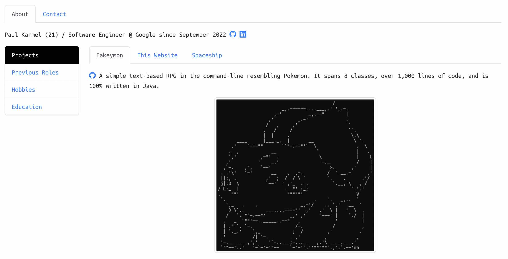

## Paul's personal programming portfolio
### Access it @ [paulkia.github.io](https://paulkia.github.io/)
I wanted to build something simplistic and flexible to all devices and screens. It's very bare-bones. The goal was also of having maximum customization (therefore no template) but minimal CSS.

This project was bootstrapped with [React-Bootstrap](https://react-bootstrap.github.io/).

